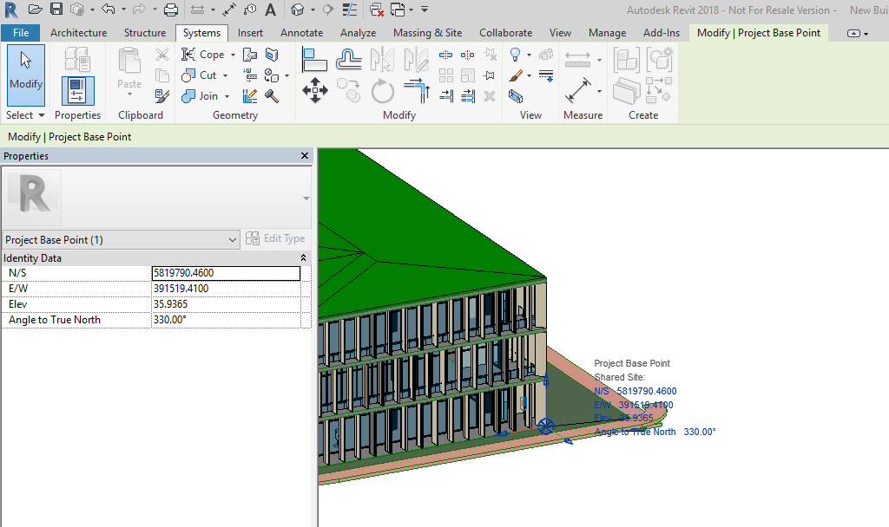
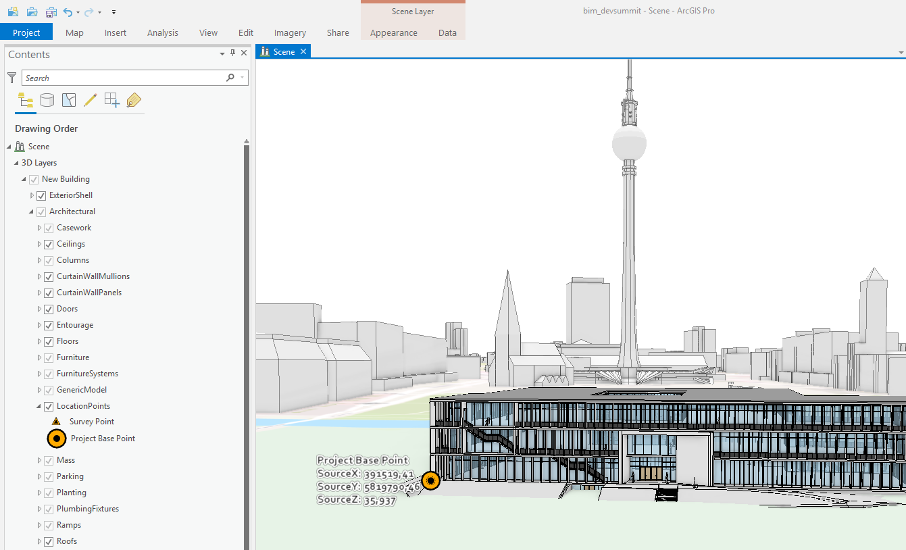
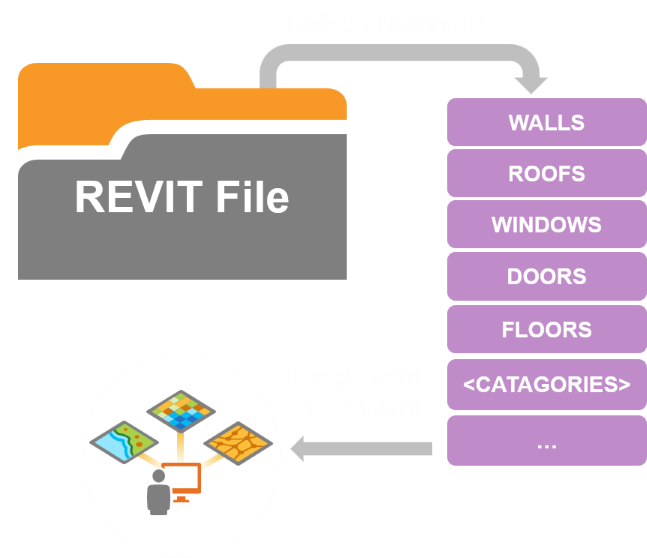
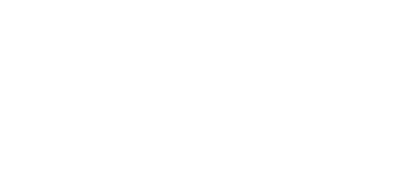
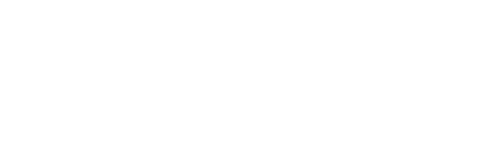
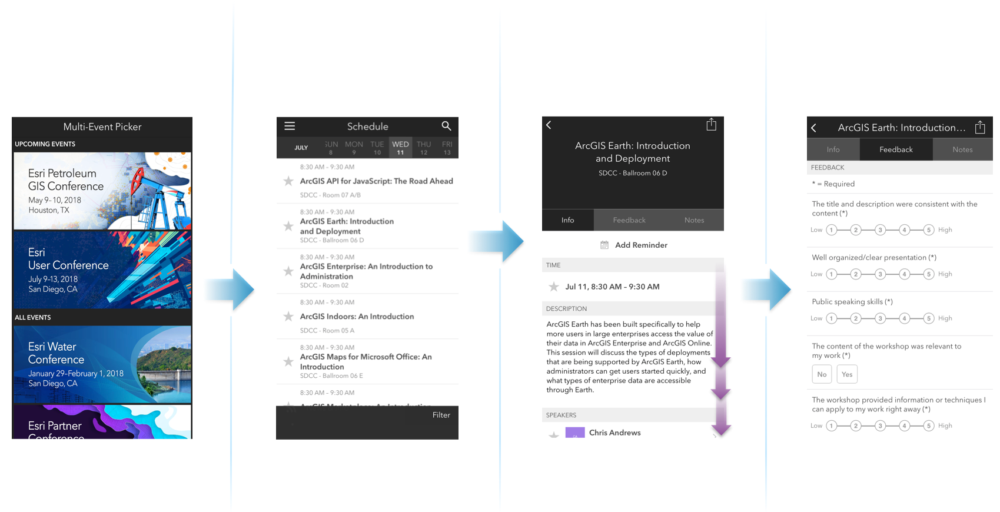

<!-- .slide: data-background="./images/bg-1.png" -->

<h2 style="font-size: 2em;">BIM/Revit and Building Scene Layer</h2>

By &Ouml;zg&uuml;r Ertac &amp; Yannik Messerli

---

<!-- .slide: data-background="./images/bg-2.png" -->

# Agenda

- Introduction to BIM and Revit
- Revit-as-a-service
- Introduction to ArcGIS Javascript API
- Using the BuildingSceneLayer
- Go beyond (the walls)

---

<!-- .slide: data-background="./images/bg-2.png" -->

## Building Information Modeling

***BIM is a process not an application!***

---

<!-- .slide: data-background="./images/bg-2.png" -->

### Building Information Modeling

<section style="text-align: justify;">
A 3D model-based process that provides professionals info and tools to efficiently plan, design, construct and manage buildings and structures.

A BIM object is a combination of:
- Design
- Geometry for physical chracteristics
- Relations and attributes (Meta Data)
- Intelligent 2D- & 3D-Objects
</section>

---

<!-- .slide: data-background="./images/bg-2.png" -->

## Revit Data

<section style="text-align: left;">
Revit is not BIM, Revit is built for BIM

- design with parametric modeling and drafting elements
- mutliple views of same geometry
- a change anywhere is a change everywhere

</section>

---

<!-- .slide: data-background="./images/bg-2.png" -->

## Revit Data

<section style="text-align: left;">

Other BIM standards / software
- IFC
- Bentley Arch
- Allplan
- BricsCAD and [many more](https://financesonline.com/building-information-modeling/)
</section>

---

<!-- .slide: data-background="./images/bg-2.png" -->

## Georeference a Revit Data

<section style="text-align: left;">
ArcGIS Pro can display Revit in correct location!
Requirements:

- Projection file (name.prj)
- World file (name.wld3)
- Revit control points (Project Base Point, Survey Point)

</section>

---

<!-- .slide: data-background="./images/bg-2.png" -->

### Georeference a Revit Data

---

<!-- .slide: data-background="./images/bg-2.png" -->

### Revit in ArcGIS Pro

---

<!-- .slide: data-background="./images/bg-2.png" -->

### Revit in ArcGIS Pro

---

<!-- .slide: data-background="./images/bg-2.png" -->

### Sharing Revit as a Service

<section style="text-align: left;">
Introducing a new I3S layer for buildings

- Building Scene Layer (Pro 2.3, Enterprise 10.7) 
- Model categories in Revit data structure
- Load Revit in ArcGIS Pro -> Share as SLPK -> Upload to Portal
- Visual filtering, saved filters & levels, categories

</section>

---

<!-- .slide: data-background="./images/bg-2.png" -->

### Sharing Revit as a Service

<section style="text-align: left;">
Limitations

- one revit file -> one building scene layer
- not updatable from source directly
- no materials / textures

</section>

---

<!-- .slide: data-background="./images/bg-3.png" -->

# A slide template

    ---

    <!-- .slide: data-background="./images/bg-3.png" -->

    # A slide template

    Your text

---

<!-- .slide: data-background="./images/bg-2.png" -->

## Consuming a service

You can consume it in severals way. We will focus how to consume it into a browser using the ArcGIS Javascript API

---

<!-- .slide: data-background="./images/bg-3.png" -->

## Quick intro to the ArcGIS Javascript API

   
- Visual mapping (2D & 3D), components and widgets
- Support for various different layer types (data sources)
- Integration with the ArcGIS platform (security, sign-in, premium services, …)

Find doc & samples to get started at [https://developers.arcgis.com/javascript](https://developers.arcgis.com/javascript)

---

<!-- .slide: data-background="./images/bg-3.png" -->

## Quick intro to the ArcGIS Javascript API

Simple steps to use the API:

1. Create a HTML page and reference the API
1. Create a scene
1. Import the service

---
<!-- .slide: data-background="./images/bg-3.png" data-transition="none"  -->
## Creating basic HTML file

    <pre><code style="margin-bottom: -30px;" class="lang-html">
    &lt;!DOCTYPE html&gt;
    &lt;html&gt;
    &lt;head&gt;
      &lt;meta charset=&quot;utf-8&quot;&gt;
    </code>
    <code style="margin-bottom: -30px;" class="grey">
      &lt;link rel=&quot;stylesheet&quot; href=&quot;//js.arcgis.com/4.13/esri/css/main.css&quot;&gt;
      &lt;script src=&quot;//js.arcgis.com/4.13/&quot;&gt;&lt;/script&gt;
    </code>
    <code style="margin-bottom: -30px;" class="lang-html">
      &lt;title&gt;Create a 3D map&lt;/title&gt;
    &lt;/head&gt;
    &lt;body&gt;
      &lt;script&gt;
      &lt;/script&gt;
      &lt;div id=&quot;viewDiv&quot;&gt;&lt;/div&gt;
    &lt;/body&gt;
    &lt;/html&gt;
    </code>
    

  </pre>

---
<!-- .slide: data-background="./images/bg-3.png" data-transition="none"  -->
## Reference the ArcGIS API for JavaScript

    <pre><code style="margin-bottom: -30px;" class="grey">
    &lt;!DOCTYPE html&gt;
    &lt;html&gt;
    &lt;head&gt;
      &lt;meta charset=&quot;utf-8&quot;&gt;
    </code>
    <code style="margin-bottom: -30px;" class="lang-html">
      &lt;link rel=&quot;stylesheet&quot; href=&quot;//js.arcgis.com/4.13/esri/css/main.css&quot;&gt;
      &lt;script src=&quot;//js.arcgis.com/4.13/&quot;&gt;&lt;/script&gt;
    </code>
    <code style="margin-bottom: -30px;" class="grey">
      &lt;title&gt;Create a 3D map&lt;/title&gt;
    &lt;/head&gt;
    &lt;body&gt;
      &lt;script&gt;
      &lt;/script&gt;
      &lt;div id=&quot;viewDiv&quot;&gt;&lt;/div&gt;
    &lt;/body&gt;
    &lt;/html&gt;
    </code>

</pre>

---
<!-- .slide: data-background="./images/bg-3.png" data-transition="none" -->
## Instantiate the webscene

    <pre><code style="margin-bottom: -30px;" class="grey">
    &lt;!DOCTYPE html&gt;
    &lt;html&gt;
    &lt;head&gt;
      &lt;meta charset=&quot;utf-8&quot;&gt;
    </code>
    <code style="margin-bottom: -30px;" class="grey">
      &lt;link rel=&quot;stylesheet&quot; href=&quot;//js.arcgis.com/4.13/esri/css/main.css&quot;&gt;
      &lt;script src=&quot;//js.arcgis.com/4.13/&quot;&gt;&lt;/script&gt;
    </code>
    <code style="margin-bottom: -30px;" class="grey">
      &lt;title&gt;Create a 3D map&lt;/title&gt;
    &lt;/head&gt;
    &lt;body&gt;
      &lt;script&gt;
    </code>
    <code style="margin-bottom: -30px;" class="lang-js">
        require([
          "esri/WebScene",
          "esri/views/SceneView",
          "dojo/domReady!"
        ], function(WebScene, SceneView) {
          var scene = new WebScene();
          var view = new SceneView({
            container: "viewDiv",
            map: scene
          });
        });
    </code>
    <code class="grey">
      &lt;/script&gt;
      &lt;div id=&quot;viewDiv&quot;&gt;&lt;/div&gt;
    &lt;/body&gt;
    &lt;/html&gt;
    </code>

</pre>

---
<!-- .slide: data-background="./images/bg-3.png" -->
## Demo

<iframe id="scene-view-map-view" data-src="./snippets/setup-snippet-1.html" scrolling="no" style="overflow: hidden;padding: 0;"></iframe>

---
<!-- .slide: data-background="./images/bg-3.png" -->
### Notes about the `SceneView` class

- Property `camera` let's you manipulate our viewpoint
- `map` holds the GIS information

---
<!-- .slide: data-background="./images/bg-3.png" -->
### Notes about the `Webscene` class

- Can be initiate using services from `SceneLayerPackages`
- Property `layers` represents the different level of GIS information
- `basemap` describes the information draped on the 3D elevation surface of the sphere

---

<!-- .slide: data-background="../images/bg-8.png" -->

## Layers

Layers traditionally contains the GIS information and data, usually features of same type and their properties. 

---

<!-- .slide: data-background="../images/bg-8.png" -->

## Layers

|              |  |
|--------------|--|
| `FeatureLayer` | <small>2D & 3D</small> |
| `CSVLayer` | <small>2D & 3D</small> |
| `MapImageLayer` | <small>2D & 3D</small> |
| `ImageryLayer` | <small>2D & 3D</small> |
| `WMSLayer` | <small>2D & 3D</small> |
| `TileLayer` | <small>2D & 3D</small> |
| `WMTSLayer` | <small>2D & 3D</small> |
| `VectorTileLayer` | <small>2D & 3D</small> |
| `ElevationLayer` | <small> 3D only</small> |
| `SceneLayer` | <small> 3D only</small> |
| `BuildingSceneLayer` | <small> 3D only</small> |

---

<!-- .slide: data-background="../images/bg-8.png" -->

## SceneLayer

`SceneLayer` however is optimized for displaying large amounts of 3D data along side the GIS data. `BuildingSceneLayer` is a variation of it for BIM data.

---
<!-- .slide: data-background="./images/bg-3.png" -->
## Layers

For example:

    <pre>
    <code style="margin-bottom: -40px;" class="lang-js">
        var layer = new BuildingSceneLayer({
          portalItem: {
            url: "https://..."
          }
        });
        scene.add(layer);
    </code>

</pre>

Where you pass the url to the service. 

---
<!-- .slide: data-background="./images/bg-3.png" -->
## Demo

<iframe id="setup-snippet-2" data-src="./snippets/setup-snippet-2.html" scrolling="no" style="overflow: hidden;padding: 0;"></iframe>

---
<!-- .slide: data-background="./images/bg-3.png" -->
## BuildingSceneLayer

- Same properties than `SceneLayer`, with additions:
- `filters` and the `activeFilterId`
- `sublayers`

---
<!-- .slide: data-background="./images/bg-3.png" data-transition="none" -->
## Building's sublayers
 

Two flavours: `BuildingComponentSublayer` and `BuildingGroupSublayer`:

 

- `ModelName` is a standard name for each sublayer
- `visible` if the sublayer is visible in the view 
- `opacity` of the sublayers individually
- `sublayers` if `BuildingGroupSublayer`

`BuildingComponentSublayer` has in addition field you can find in a `SceneLayer`, e.g. `renderer`, `definitionExpression`, `popupTemplate`, ...

---
<!-- .slide: data-background="./images/bg-3.png" data-transition="none" -->
## Building's sublayers

  

          
    <h4>First level of sublayers:<h4>
    
  

  

    <iframe id="code-snippet-3" data-src="./snippets/setup-snippet-3.html" scrolling="no" style="overflow: hidden;padding: 0; min-width: 400px;" frameborder="0"></iframe>
  

---
<!-- .slide: data-background="./images/bg-3.png" data-transition="none" -->
## Disciplines

<h4>Second level of sublayers<h4>

---
<!-- .slide: data-background="./images/bg-3.png" data-transition="none" -->
## Disciplines

<h4>Second level of sublayers<h4>

<iframe id="code-snippet-3" data-src="./snippets/setup-snippet-3.html" scrolling="no" style="overflow: hidden;padding: 0; width: 700px; min-height: 261px;height: 261px;" frameborder="0"></iframe>

---
<!-- .slide: data-background="./images/bg-3.png" -->
## Filtering

---

### Please Take Our Survey on the App

